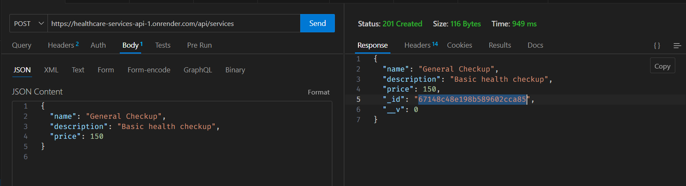
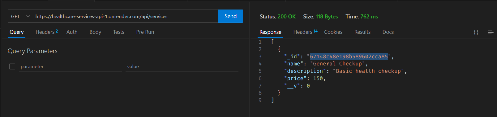
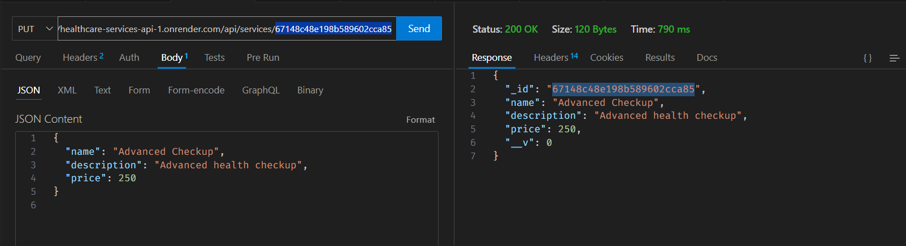

# Healthcare Services API

This project is a simple API to manage healthcare services, built using Node.js, Express, and MongoDB.

## Table of Contents
- [Features](#features)
- [Installation](#installation)
- [Usage](#usage)
- [API Endpoints](#api-endpoints)
- [Deployment](#deployment)
- [Screenshots](#screenshots)


## Features
- Add, update, delete, and get healthcare services.
- Basic validation for required fields.

## Installation

1. Clone the repository:

   ```bash
   git clone https://github.com/akash-masram/healthcare-services-api.git

2. Navigate to the project directory:

   ```bash
   cd healthcare-services-api

3. Install the dependencies:

   ```bash
   npm install

4. Create a `.env` file in the root directory and add your MongoDB connection string:

   ```plaintext
   MONGO_URI=mongodb+srv://<username>:<password>@cluster0.mongodb.net/<dbname>?retryWrites=true&w=majority

## Usage

Start the server:

   ```bash
   node server.js
   ```


The API will be running on [http://localhost:3000](http://localhost:3000).

## API Endpoints

### Add a new service

- **POST** `/api/services`
- Request body:

```json
  {
    "name": "Service Name",
    "description": "Service Description",
    "price": 100
  }
```
- **Endpoint:** [POST http://localhost:3000/api/services](http://localhost:3000/api/services)
  

### Get all services

**GET** `/api/services`
- **Endpoint:** [POST http://localhost:3000/api/services](http://localhost:3000/api/services)


### Update a service

 **PUT** `/api/services/:id`
- Request body:

```json
  {
    "name": "Updated Service Name",
    "description": "Updated Description",
    "price": 150
  }
```
- **Endpoint:** [PUT http://localhost:3000/api/services/:id](http://localhost:3000/api/services/:id)

### Delete a service

- **DELETE** `/api/services/:id`
- **Endpoint:** [PUT http://localhost:3000/api/services/:id](http://localhost:3000/api/services/:id)


## Deployment

You can deploy this API on platforms like Render, Heroku, or Vercel. 

### Deploying on Render

1. Sign in to your Render account.
2. Create a new web service and connect it to your GitHub repository.
3. Set the environment variable `MONGO_URI` in the Render dashboard with your MongoDB connection string.
4. Choose the branch to deploy and click on "Create Web Service."
5. Render will automatically build and deploy your service.


After deployment, your API will be accessible via the following link: [Healthcare Services API](https://healthcare-services-api-1.onrender.com).
)

## Screenshots

Here are some screenshots demonstrating the API in action:

### 1. Adding a New Service


### 2. Get All Services


### 3. Update a Service


### 4. Delete a Service


## Acknowledgments

Thank you for exploring the Healthcare Services API! If you have any questions or suggestions, feel free to reach out. Contributions are welcome, so please open an issue or submit a pull request if you'd like to contribute.

Happy coding!


